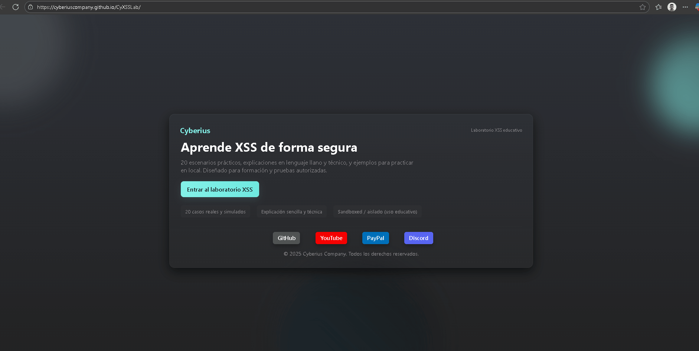

<p align="center">
  
  <strong>Español</strong>
  &nbsp;|&nbsp;
  <a href="README.en.md">
    
    <strong>English</strong>
  </a>
  &nbsp;|&nbsp;
  <a href="https://www.youtube.com/watch?v=xvFZjo5PgG0&list=RDxvFZjo5PgG0&start_radio=1&pp=ygUTcmljayByb2xsaW5nIG5vIGFkc6AHAQ%3D%3D">
    
    <strong>日本語</strong>
  </a>
</p>

<p align="center">
  
</p>

# Laboratorio XSS Educativo 
Aprende y practica Cross-Site Scripting (XSS) de forma totalmente segura y aislada.
Este laboratorio incluye 20 escenarios reales y simulados, cada uno con:

- 🟢 Explicación en lenguaje sencillo
- 🔵 Explicación técnica
- 🟣 Ejemplo real de uso
- 🟠 Payload sugerido
- 🟩 Ejecución sandboxed (segura)
- 🟦 Área para editar y probar tus propios payloads

Diseñado para formación, estudiantes, pentesters, instructores y equipos de seguridad.
---

<h2 align="center">Panel Principal</h2>
<p align="center">
  
</p>

<h2 align="center">Apartado de Ejercicios</h2>
<p align="center">
  
</p>

<h2 align="center">Resolviendo un caso de XSS</h2>
<p align="center">
  
</p>

---

## 🎥 Demostración

<p align="center">
  
</p>

---

## 📚 ¿Qué laboratorios incluye este laboratorio?

1. 🟦 innerHTML — Inserción directa de HTML sin filtrar  
2. 🟥 location.hash — Reflejo del hash de la URL sin validar  
3. 🟧 document.write — Inyección en tiempo de carga  
4. 🟪 eval() — Ejecución de JavaScript controlado por el usuario  
5. 🟨 img onerror — Ejecución mediante eventos de imagen  
6. 🟩 iframe.srcdoc — HTML inyectado dentro de iframes  
7. 🔵 insertAdjacentHTML — Inserción de HTML en el DOM  
8. 🔴 onclick attribute — Inyección en atributos de eventos  
9. 🟠 query param (?q=) — Reflejo directo de parámetros en la página  
10. 🟣 script tag innerHTML — Creación insegura de etiquetas <script>  
11. 🟩 Stored XSS (simulación) — Payload persistente almacenado  
12. 🟦 SVG con eventos — XSS mediante imágenes vectoriales  
13. 🟥 javascript: href — Enlaces que ejecutan código  
14. 🟧 data: URI en imágenes — Payloads embebidos en data-URIs  
15. 🟪 template.innerHTML — Uso inseguro de plantillas HTML  
16. 🟨 JSONP / callback injection — Ejecución vía funciones callback  
17. 🔵 postMessage reflection (DOM XSS) — Reflejo de mensajes entre ventanas  
18. 🔴 CSS injection (style=) — Inyección dentro de estilos  
19. 🟠 DOM Mutation Insertion — Inserción cuando el DOM muta  
20. 🟣 CSP bypass (unsafe-inline) — Bypass por políticas laxas de CSP

## 🧰 Tecnologías utilizadas

- HTML5 + CSS3
- JavaScript vanilla (sin frameworks)
- FontAwesome
- Entorno aislado / DOM sandbox

## 📁 Estructura del proyecto

```bash
├── index.html # Index principal de la portada
├── index-lab-xxs.html # Index principal del laboratorio
├── app.js # Funciones javascript del proyecto generales
├── styles.css # css principal del index.html
├── styles-lab-xxs.css # css principal del index-lab-xxs.html
```
---

## 📄 Documentación adicional

- [🤝 Código de Conducta](.github/CODE_OF_CONDUCT.md)
- [📬 Cómo contribuir](.github/CONTRIBUTING.md)
- [🔐 Seguridad](.github/SECURITY.md)
- [⚠️Aviso legal](DISCLAIMER.md)
- [📜 Licencia](LICENSE)
- [📢 Soporte](.github/SUPPORT.md)


---

## ⚙️ 1.0 Acceso al proyecto vía Github Pages

```bash
https://cyberiuscompany.github.io/CyXSSLab/
```

